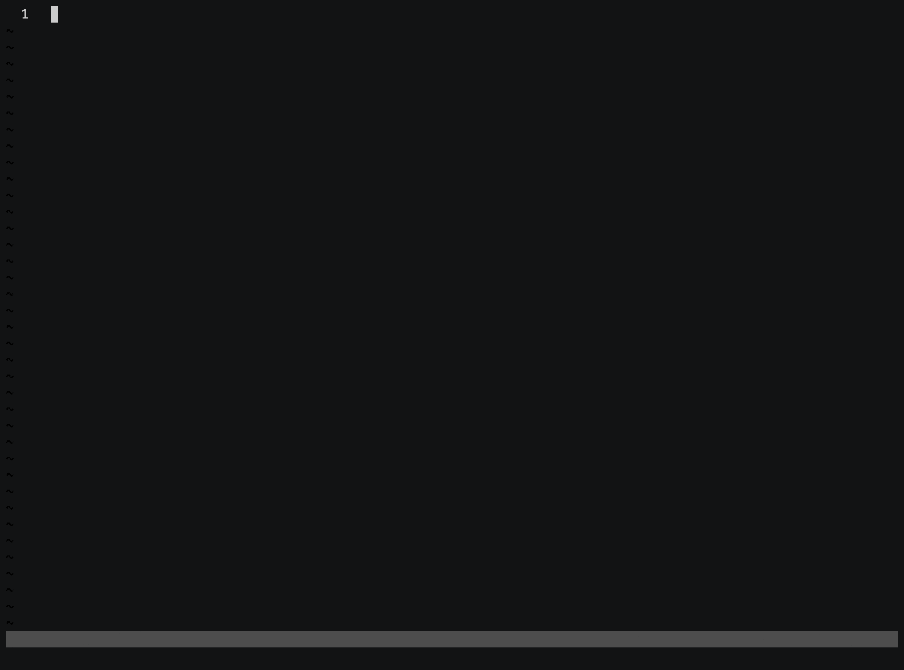

# Mokku

<!-- TODO: logo instead of H1-->

<!-- TODO: go awesome badge -->
<!-- TODO: coverage badge -->

[](https://github.com/kinbiko/mokku/actions)
[](https://goreportcard.com/report/github.com/kinbiko/mokku)
[](https://github.com/kinbiko/mokku/releases)
[](https://pkg.go.dev/github.com/kinbiko/mokku?tab=doc)
[](https://github.com/kinbiko/mokku/blob/master/LICENSE)

## Installation

```sh
$ go get github.com/kinbiko/mokku/cmd/mokku
```

## Usage

[](https://asciinema.org/a/i4zBQ3UPkQ7d7KB0kKtHpFdzW?speed=2)

```sh
# Copy the interface
$ mokku
# Paste the mock
```

That's it.

### Using the generated code

If you have been writing your own mocks or if you're familiar with
[`Moq`](github.com/matryer/moq) then the usage will look very familiar to you:

```go
func TestRegisterUser(t *testing.T) {
	var (
		got = ""
		exp = "kinbiko"
	)

	mock := &UserRepositoryMock{
		CreateFunc: func(userName string) error {
			got = userName
			return nil
		},
	}

	RegisterUser(exp, mock)

	if got != exp {
		t.Errorf("expected user name '%s' but got '%s'", exp, got)
	}
}

func RegisterUser(userName string, repo UserRepository) {
	// ... Code that includes a call to 'repo.Create(userName)'
}
```

## Philosophy

This tool has been built with inspiration lovingly taken from [`Moq`](github.com/matryer/moq), and fuelled by the frustration of using [`gomock`](https://github.com/golang/mock).

Key ideas:

- Invisible: No need to introduce dependencies or `//go:generate` directives in your codebase.
- Integration friendly: Easy to integrate in your workflow, regardless of editor.
- File/package agnostic: `mokku` doesn't care where exactly it lives on your system or even whether the copied code compiles yet.

## Contributing

Please raise an issue to discuss any changes you'd like to make to this project.
If you wish to contribute, but need some ideas, please check out the [GitHub project for this repository](github.com/kinbiko/mokku/projects/2).

## Gratitude

This project is has been made possible thanks to my employer who let me work on this project during [Mercari Hack Week](https://mercan.mercari.com/en/articles/21188/).
