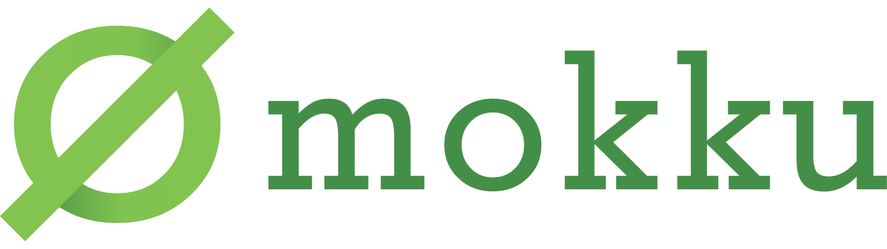

<!-- TODO: go awesome badge -->
<!-- TODO: coverage badge -->

[](https://github.com/kinbiko/mokku/actions)
[](https://goreportcard.com/report/github.com/kinbiko/mokku)
[](https://github.com/kinbiko/mokku/releases)
[](https://pkg.go.dev/github.com/kinbiko/mokku?tab=doc)
[](https://github.com/kinbiko/mokku/blob/master/LICENSE)

A clipboard-based mocking framework for Go that gets out of your way.

This tool has been built with inspiration lovingly taken from [`Moq`](https://github.com/matryer/moq), and fuelled by the frustration of using [`gomock`](https://github.com/golang/mock).

Key ideas:

- Invisible: No need to introduce dependencies or `//go:generate` directives in your codebase.
- Integration friendly: Easy to integrate in your workflow, regardless of editor.
- File/package agnostic: `mokku` doesn't care where exactly your code lives on your system or even whether it compiles yet.

## Installation

```sh
$ go get github.com/kinbiko/mokku/cmd/mokku
```

## Usage

```sh
# Copy the interface
$ mokku
# Paste the mock
```

That's it. Below is an example of how to use `mokku` within vim.

[](https://asciinema.org/a/i4zBQ3UPkQ7d7KB0kKtHpFdzW?speed=2)

### Using the generated code

If you have been writing your own mocks or if you're familiar with
[`Moq`](github.com/matryer/moq) then the usage will look very familiar to you:

```go
func TestRegisterUser(t *testing.T) {
	var (
		got = ""
		exp = "kinbiko"
	)

	mock := &UserRepositoryMock{
		CreateFunc: func(userName string) error {
			got = userName
			return nil
		},
	}

	RegisterUser(exp, mock)

	if got != exp {
		t.Errorf("expected user name '%s' but got '%s'", exp, got)
	}
}

func RegisterUser(userName string, repo UserRepository) {
	// ... Code that includes a call to 'repo.Create(userName)'
}
```

### Defining Custom Templates

You can also define your own custom template to use for your mocks, by defining `MOKKU_TEMPLATE_PATH` that is the path to a file containing a Go text template, that uses the same variables found in the default template:

```go
const defaultTemplate = `
type {{.TypeName}}Mock struct { {{ range .Methods }}
	{{.Name}}Func func{{.Signature}}{{ end }}
}
{{if .Methods }}{{$typeName := .TypeName}}
{{range $val := .Methods}}func (m *{{$typeName}}Mock) {{$val.Name}}{{$val.Signature}} {
	if m.{{$val.Name}}Func == nil {
		panic("unexpected call to {{$val.Name}}")
	}
	{{if $val.HasReturn}}return {{ end }}m.{{$val.Name}}Func{{$val.OrderedParams}}
}
{{ end }}{{ end }}`
```

[See the GoDocs](https://pkg.go.dev/github.com/kinbiko/mokku?tab=doc) for a more detailed explanation of the template variables.

## Contributing

Please raise an issue to discuss any changes you'd like to make to this project.
If you wish to contribute, but need some ideas, please check out the [GitHub project for this repository](https://github.com/kinbiko/mokku/projects/2).

## Gratitude

This project is has been made possible thanks to my employer who let me work on this project during [Mercari Hack Week](https://mercan.mercari.com/en/articles/21188/).
